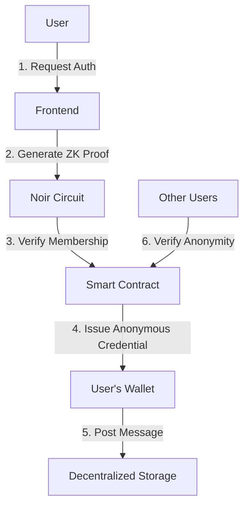

# 🤫 Whisper

[](https://opensource.org/licenses/MIT)
[](https://twitter.com/intent/tweet?text=Check%20out%20Whisper%20-%20Anonymous%20messaging%20with%20ZK%20proofs%20%40whisper%20%23privacy%20%23zeroknowledge)

Whisper is a privacy-preserving messaging platform that leverages **Noir** and **Zero-Knowledge Proofs** to enable anonymous communication within organizations while maintaining verifiable membership.

## 🌟 Features

- **Anonymous Messaging** - Post messages without revealing your identity
- **Organization Verification** - Prove membership using Zero-Knowledge Proofs
- **Noir-Powered** - Built with Noir for efficient ZK circuit implementation
- **Decentralized Identity** - No central authority controls user identities
- **End-to-End Security** - Cryptographic guarantees of privacy

## 🚀 Quick Start

1. Visit [whisper.xyz](https://whisper.xyz)
2. Verify your organization membership using ZK proofs
3. Start posting anonymous messages with cryptographic guarantees

## 🛠️ Technical Architecture



## 🔍 How It Works

### 1. Identity Setup
- Users generate a cryptographic identity using Ed25519
- Organization membership is verified off-chain
- A ZK proof is generated using Noir to prove membership without revealing identity

### 2. Noir Implementation
```rust
// Example Noir circuit for membership proof
fn main(
    // Private inputs
    user_secret: Field,
    // Public inputs
    organization_root: pub Field,
    proof_path: [Field; 32]
) -> pub Field {
    // Verify Merkle proof of membership
    let computed_root = compute_merkle_root(user_secret, proof_path);
    assert(computed_root == organization_root);
    
    // Return 1 if verification passes
    1 as Field
}
```

### 3. Message Flow
1. User generates a ZK proof of organization membership
2. Proof is verified on-chain
3. Upon successful verification, user receives an anonymous credential
4. Messages are encrypted and stored with metadata separation
5. Other users can verify message authenticity without knowing the sender

## 🛠️ Development Setup

### Prerequisites
- Node.js 18+
- Noir (nargo) installed
- Foundry (for smart contract testing)

### Installation
```bash
# Clone the repository
git clone https://github.com/yourusername/whisper.git
cd whisper/app

# Install dependencies
npm install

# Set up environment variables
cp .env.example .env.local
# Edit .env.local with your configuration

# Start development server
npm run dev
```

## 📚 Documentation

For detailed documentation, please visit our [documentation site](https://docs.whisper.xyz).

## 🤝 Contributing

We welcome contributions! Please see our [Contributing Guidelines](CONTRIBUTING.md) for details.

1. Fork the repository
2. Create a feature branch (`git checkout -b feature/amazing-feature`)
3. Commit your changes (`git commit -m 'Add some amazing feature'`)
4. Push to the branch (`git push origin feature/amazing-feature`)
5. Open a Pull Request

## 📄 License

This project is licensed under the MIT License - see the [LICENSE](LICENSE) file for details.

## 🔒 Security

Security is our top priority. If you discover any security issues, please report them to security@whisper.xyz.

## 🌐 Connect

- [Website](https://whisper.xyz)
- [Twitter](https://twitter.com/whisper)
- [Discord](https://discord.gg/whisper)
